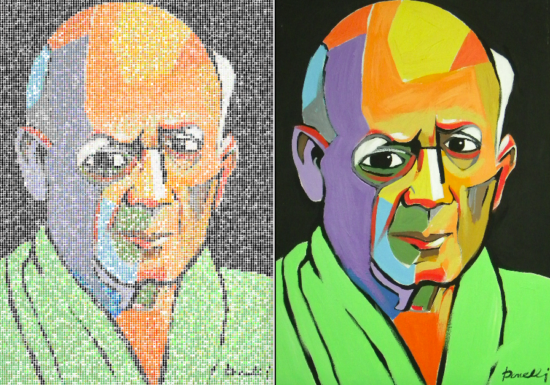

# Brainart

[gallery](http://vsoch.github.io/brainart)

What do you get when you combine open source brainmaps with art? Why, BrainArt of course! Generate a rendering (made with brains) of an image of your choice using images from the [NeuroVault](http://www.neurovault.org) database! After generation of your image, clicking on any of the tiny brains will take you to the brain statistical map. Current image lookup tables are optimized for highly colorful images, either with black or white background. You can generate your own brain images on your computer, and contribute to our gallery!

### Installation

      pip install brainart

This will place an executable, 'brainart' in your system folder.

      usage: brainart [-h] --input IMAGE [--db DB] [--sample SAMPLE] [--N N]
                      [--update] [--background-color BGCOLOR]
                      [--color-lookup LOOKUP] [--output-folder OUTPUT]

      make images out of brain imaging data

      optional arguments:
        -h, --help            show this help message and exit
        --input IMAGE         full path to jpg image
        --db DB               path to folder for png images for database
        --sample SAMPLE       sample every SAMPLEth pixel
        --N N                 Number of top N brains to sample from when seleting
                              image. Larger N means more variation in brains and
                              color.
        --update              regenerate png database
        --background-color BGCOLOR
                              background color
        --color-lookup LOOKUP
                              color lookup (white, black) which currently determined
                              background color.
        --output-folder OUTPUT
                              output folder for html file

### Generate an image

      brainart --input /home/vanessa/Desktop/flower.jpg

It will open in your browser, and tell you the location of the output file, if you want to save it. 

### Color Lookup Tables
The default package comes with two lookup tables, which are generated from a combination of matplotlib color maps (for the brains with multiple colors) and single hex values (the single colored brains for colors not well represented in matplotlib). To see how to generate a set of image data for the package, see [example/make_mosaic.py](example/make_mosaic.py). Currently, choice of a color lookup table just means choosing a black or white background, and in the future could be extended to color schemes or different brain orientations. The way to specify this:

     brainart --input /home/vanessa/Desktop/roman.jpg --color-lookup black

Where the options are `black` `white`.

### Selection Value N
By default, the algorithm randomly selects from the top N sorted images with color value similar to the pixel in your image. You can imagine this means there is a tradeoff - larger values of N mean more variation in both color and brain images. You can adjust this value:

      brainart --input /home/vanessa/Desktop/roman.jpg --N 100

### Sampling Rate
You can also modify the sampling rate to produce smaller images. The default is every 15 pixels, which seems to generally produce a good result. To change this:

      brainart --input /home/vanessa/Desktop/roman.jpg --sample 100

### Gallery
The [gallery](http://vsoch.github.io/brainart) is the index file hosted on the github pages for this repo. To submit a file to it, you can clone this repo:

      git clone https://www.github.com/vsoch/brainart

Check out the gh-pages branch

      git checkout -b gh-pages
      git pull origin gh-pages

Add your file to the folder called "gallery" and then regenerate the static index.html like so. You will need to install my visci package to quickly generate the template:

      cd scripts  #!important
      pip install visci
      python generate_gallery.py

This will update the `index.html` in the main folder, which renders on github pages. Now just submit the PR, and you're done! You can also email directly to me, if you are not comfortable with github. Submissions are greatly appreciated, and fun :)

### Under Development
Currently, works best for colorful images (unfortunately this does not include faces) as the color maps are pulled directly from matplotlib. And we know what can be found there! We need to add color maps for skin tones, etc, and faces will be better rendered.

Image generation is slow, based on sampling every 10th pixel. If you change the sample rate, you may need to alter the d3 to change the spacing between the brains. It would be optimal to generate the x,y coordinates in the python to best render for the sampling rate. It would also be desired to have a faster generation of the image. Please contribute! :_)
